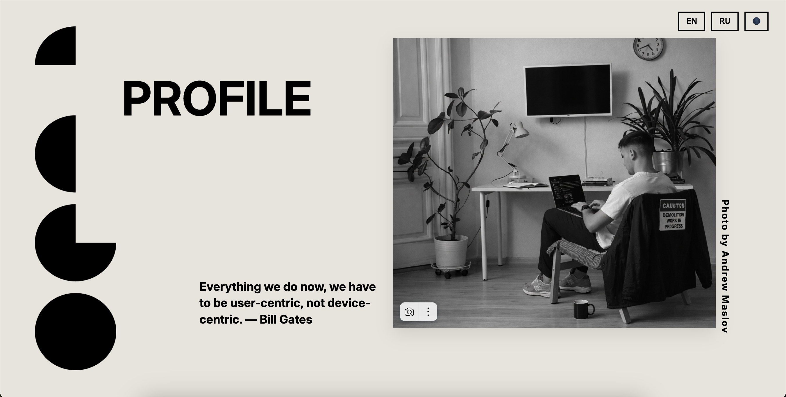
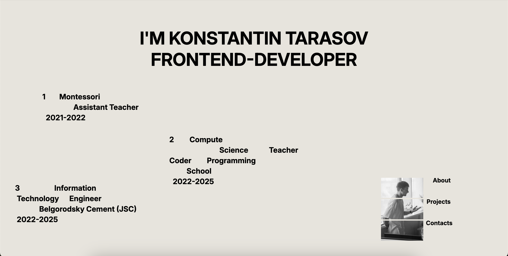
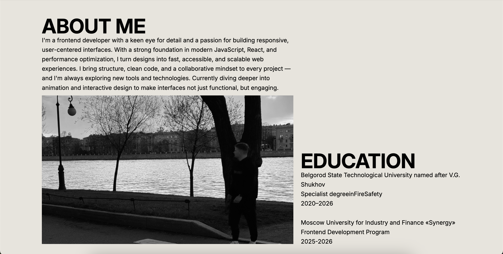
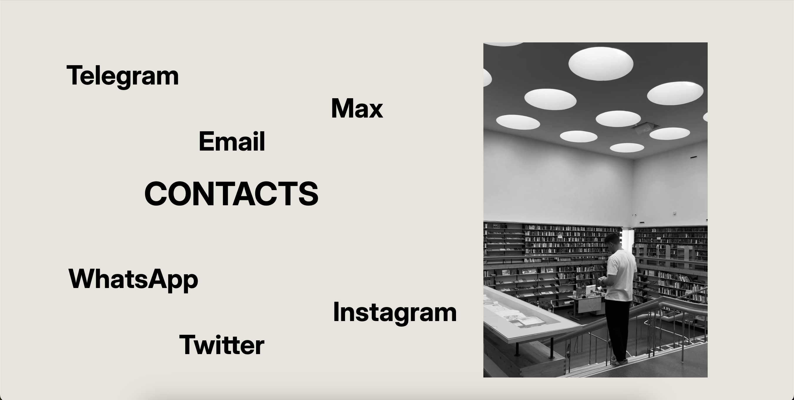

# 💼 Frontend Developer Portfolio

Интерактивное портфолио-приложение, демонстрирующее мои навыки во frontend-разработке.

Основной фокус:
- архитектура приложения  
- работа с TypeScript  
- переиспользуемые компоненты  
- построение UI  

---

## 🌐 Live Demo

👉 https://portfolio-mu-ebon-97.vercel.app/

---

## 📸 Screenshots







---

## ✨ Features

- 📂 Отображение проектов
- 🧠 Демонстрация навыков
- 🌙 Переключение темы (light / dark)
- 🌍 Локализация (i18n)
- 📱 Адаптивный дизайн
- ⚡ Быстрая загрузка (Vite)

---

## 🛠 Tech Stack

- React
- TypeScript
- Vite
- SCSS / CSS Modules
- Context API

---

## 🧠 Architecture

Проект организован по компонентному подходу с разделением ответственности:

- components/ — UI-компоненты (About, Contact, Projects, ThemeButton и др.)
- context/ — глобальное состояние (например, тема приложения)
- i18n/ — конфигурация локализации
- api/ — подготовка к работе с внешними данными
- assets/ — статические ресурсы

Подход позволяет:
- изолировать логику
- переиспользовать компоненты
- упростить поддержку

---

## ⚙️ Installation

```bash
git clone https://github.com/taro4kaaaaa/Portfolio.git
cd Portfolio
npm install
npm run dev